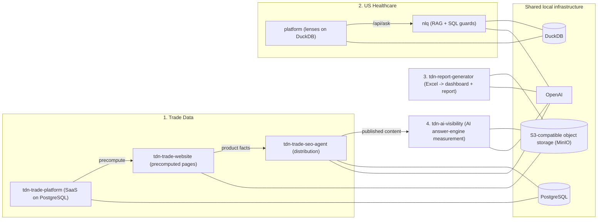

# TransDataNexus Portfolio

Data products for pharmaceutical and healthcare markets, built and operated end to end by [Suresh Sormare](https://github.com/sureshsormare): trade intelligence, US healthcare analytics with natural-language querying, automated market-research reporting, and AI-search visibility measurement.

Every repository below is code only. Datasets, databases and credentials are never published; each README explains what data the app needs and how it is built, and each app ships a documented `.env.example` so it runs locally with your own keys.

## 1. Trade Data

| Repository | What it is | Stack |
|---|---|---|
| [tdn-trade-website](https://github.com/sureshsormare/tdn-trade-website) | Programmatic-SEO website: thousands of product, supplier, buyer, HS-code and country pages rendered from a precomputed dataset, with an admin console for indexing and crawler analytics | Next.js 15, React 19, TypeScript, d3, S3-compatible image storage |
| [tdn-trade-platform](https://github.com/sureshsormare/tdn-trade-platform) | SaaS application: shipment-level search, company and country profiles, trade-flow explorer, UN Comtrade module, auth, plans and credits | Next.js 15, PostgreSQL + Prisma, NextAuth, Recharts, d3 |
| [tdn-trade-seo-agent](https://github.com/sureshsormare/tdn-trade-seo-agent) | Distribution agent: generates platform-native content from the data, publishes through eleven platform APIs after human review, produces narrated videos, monitors communities | Next.js 15, PostgreSQL + Prisma, OpenAI + TTS, Remotion |

Highlights: pages serve with no database in the request path; a single origin variable moves the image corpus; nothing is published without an approved queue item.

## 2. TransDataNexus US Healthcare

| Repository | What it is | Stack |
|---|---|---|
| [tdn-us-healthcare](https://github.com/sureshsormare/tdn-us-healthcare) | Monorepo: an analytics platform with nine decision lenses over public CMS/FDA data on a molecule spine, and a natural-language query service that turns questions into validated SQL and grounded answers | Next.js 16, DuckDB, FastAPI, ChromaDB, OpenAI, sqlglot, Vitest (98 files), Playwright (26 specs) |

Highlights: verify-then-serve NLQ with scope and provenance guards, schema-RAG, clarify-first behaviour and a golden regression bank; read-only DuckDB with per-query memory caps so it runs on a laptop. Deep dive: [docs/nlq-rag-architecture.md](https://github.com/sureshsormare/tdn-us-healthcare/blob/main/docs/nlq-rag-architecture.md).

## 3. Report Generation Tool

| Repository | What it is | Stack |
|---|---|---|
| tdn-report-generator (private, access on request) | Monorepo: Python pipeline from an Excel market model to validated storage, LLM-assisted Word/PDF reports and a master-sheet generator, plus a Next.js comparison dashboard on the same storage | Python 3.9, Dash/Plotly, python-docx, OpenAI (gpt-4o-mini, gpt-4.1-mini); Next.js 16, React 19, Recharts, d3 |

Highlights: prompts grounded in the actual segment tables, a per-industry prompt library editable from the admin page, and one design system shared by dashboard and report. This repository is private; the code, the prompt-design and design-system write-ups, and a walkthrough are available to prospective clients on request.

## 4. AI Visibility Platform

| Repository | What it is | Stack |
|---|---|---|
| [tdn-ai-visibility](https://github.com/sureshsormare/tdn-ai-visibility) | Measures brand presence inside AI answer engines (OpenAI, Anthropic, Perplexity, Gemini): prompt runs, mention and citation parsing, competitor discovery, content gaps, AI-crawler tracking | Next.js 16, Vercel AI SDK, JSON tables on S3-compatible storage |

## How the pieces fit

## Run everything locally

Common prerequisites: Node 20+, Python 3.9+ (3.11+ for the NLQ), PostgreSQL, the DuckDB CLI, and a local S3-compatible server (MinIO). Each repository's "Getting started" section has the exact steps.

| App | Default port |
|---|---|
| Trade website | 3005 (`next dev -p 3005`) |
| Trade platform | 3000 |
| SEO agent | 3001 |
| Healthcare platform | 3000 |
| NLQ API | 8000 |
| Report generator backend (private repo) | 9000 |
| Report dashboard (private repo) | 3000 |
| AI visibility | 3000 |
| MinIO | 9100 (API), 9101 (console) |

Several apps default to port 3000; run one at a time or pass `-p`.

## How these repositories are maintained

They are code-only mirrors of private working copies, synchronised from the local workspace. Databases, datasets, generated media and the vector index are excluded by design; the data build pipelines are described in each README and can be demonstrated on request.

## Engineering principles

- **Local-first, fail-closed.** Every storage client defaults to a local endpoint when unconfigured; no app can silently reach a cloud service.
- **One spine, honest grains.** Cross-source numbers are resolved to a canonical key and never summed across grains.
- **Grounded generation.** LLM output is written from supplied numbers, checked against returned rows, and discloses interpretation; refusals and clarifications are preferred to confident wrong answers.
- **Evidence, not advice.** Dashboards and reports present signals with sources and vintages.
- **Reviewable automation.** Content leaves the system only after a human approves it.

## License

All repositories are proprietary and published for portfolio evaluation. See the LICENSE file in each repository.
