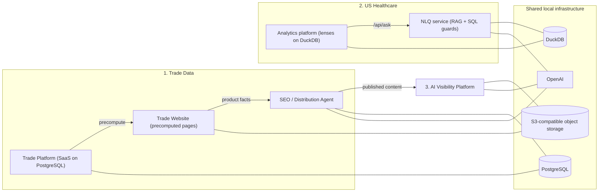

# TransDataNexus Portfolio

Data products for pharmaceutical and healthcare markets, designed, built and operated end to end by [Suresh Sormare](https://github.com/sureshsormare): trade intelligence, US healthcare analytics with natural-language querying, and AI-search visibility measurement.

> **Showcase only.** The source code for every project is private. This repository holds the public showcase: project pages, design write-ups, screenshots and recorded walkthroughs of the running applications. All rights are reserved; no licence is granted to use, copy, modify or redistribute any part of it ([LICENSE](LICENSE)). Code walkthroughs and live demonstrations are available to prospective clients on request.

## 1. Trade Data

| Project | What it is | Stack |
|---|---|---|
| [Trade Website](projects/trade-website.md) | Programmatic-SEO website: thousands of product, supplier, buyer, HS-code and country pages rendered from a precomputed dataset, with an admin console for indexing and crawler analytics | Next.js 15, React 19, TypeScript, d3, S3-compatible image storage |
| [Trade Platform](projects/trade-platform.md) | SaaS application: shipment-level search, company and country profiles, trade-flow explorer, UN Comtrade module, auth, plans and credits | Next.js 15, PostgreSQL + Prisma, NextAuth, Recharts, d3 |
| [SEO / Distribution Agent](projects/seo-agent.md) | Generates platform-native content from the data, publishes through eleven platform APIs after human review, produces narrated videos, monitors communities | Next.js 15, PostgreSQL + Prisma, OpenAI + TTS, Remotion |

## 2. TransDataNexus US Healthcare

| Project | What it is | Stack |
|---|---|---|
| [US Healthcare Analytics + NLQ](projects/us-healthcare.md) | An analytics platform with nine decision lenses over public CMS/FDA data on a molecule spine, and a natural-language query service that turns questions into validated SQL and grounded answers | Next.js 16, DuckDB, FastAPI, ChromaDB, OpenAI, sqlglot, Vitest (98 files), Playwright (26 specs) |

Design write-up: [How a question becomes a grounded answer](docs/nlq-rag-architecture.md) (schema-RAG, metric grounding, SQL validation, scope and provenance guards, clarify-first behaviour, golden regression bank).

## 3. AI Visibility Platform

| Project | What it is | Stack |
|---|---|---|
| [AI Visibility Platform](projects/ai-visibility.md) | Measures brand presence inside AI answer engines (OpenAI, Anthropic, Perplexity, Gemini): prompt runs, mention and citation parsing, competitor discovery, content gaps, AI-crawler tracking | Next.js 16, Vercel AI SDK, JSON tables on S3-compatible storage |

## Design write-ups

| Document | Covers |
|---|---|
| [NLQ RAG architecture](docs/nlq-rag-architecture.md) | Retrieval, planning, SQL generation and the verification guards behind grounded answers |
| [Programmatic SEO model](docs/programmatic-seo.md) | Page families, precompute pipeline, image pipeline, sitemaps, crawler analytics |
| [Trade data model](docs/data-model.md) | Shipment, harmonisation and account models; query patterns |
| [Distribution pipeline](docs/distribution-pipeline.md) | From a product page to published assets, videos and community monitoring |
| [AI visibility measurement model](docs/measurement-model.md) | What is measured, how engines are queried, how mentions are scored, limits |

## How the pieces fit

## Engineering principles

- **Local-first, fail-closed.** Every storage client defaults to a local endpoint when unconfigured; no application can silently reach a cloud service.
- **One spine, honest grains.** Cross-source numbers are resolved to a canonical key and never summed across grains.
- **Grounded generation.** LLM output is written from supplied numbers, checked against returned rows, and discloses interpretation; refusals and clarifications are preferred to confident wrong answers.
- **Evidence, not advice.** Dashboards and answers present signals with sources and vintages.
- **Reviewable automation.** Content leaves a system only after a human approves it.

## Requesting access

Source code, data-pipeline details and live demonstrations are shared with prospective clients under agreement. Contact through the GitHub profile.

## License

All rights reserved; showcase only. See [LICENSE](LICENSE).
