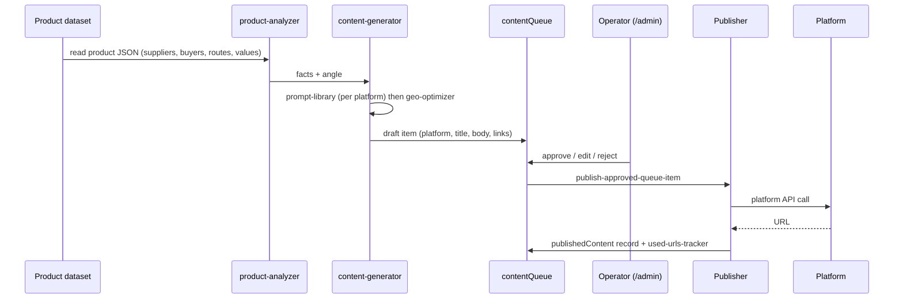

# Distribution pipeline

End-to-end flow from one product page to published assets, and the monitoring loop that feeds new work back into the queue.

## Sequence

## Stages

1. **Analyse.** `agent/engine/product-analyzer.ts` reads the precomputed JSON for a product and derives the publishable facts: top destinations, leading suppliers and buyers, value and volume movements, notable routes.
2. **Generate.** `content-generator.ts` picks the platform prompt from `prompt-library.ts` (long-form article, short post, Q&A answer, dataset description) and calls the model. `geo-optimizer.ts` then adds citation blocks, FAQ schema and structured data so AI answer engines can quote the content with attribution.
3. **Queue.** Items land in `contentQueue` with status, platform and target. `indexed-batch-planner.ts` and `batch-sync.ts` plan batches from pages the website reports as indexed (`indexed-pages-client.ts`), so distribution follows indexing.
4. **Review.** The operator works the queue in `/admin/queue` and `/admin/planner`; `rewrite-preview` and `preview` endpoints allow edits before approval.
5. **Publish.** `publish-approved-queue-item.ts` dispatches to the publisher for the item's platform; each publisher implements `base-publisher.ts` (authenticate, format, post, return URL). OAuth flows for Blogger and LinkedIn are handled by `api/agent/blogger|linkedin/connect` and `callback`.
6. **Record.** `publishedContent` stores the URL; `used-urls-tracker.ts` prevents the same page being promoted twice on the same platform.

## Video branch

`scripts/render-video.ts --stage script|audio|render|full|status` runs: `video-script-generator.ts` (script from the product facts) → `tts-engine.ts` (OpenAI TTS voice) → `video-renderer.ts` (Remotion composition) → `s3-video.ts` (store the rendered file) → `youtube-upload.ts` (YouTube Data API) → `social-captions.ts` (captions with links checked by `valid-links.ts`). `api/agent/embed-video` writes the resulting YouTube ids into the product-video map that the website reads for embeds and its video sitemap.

## Monitoring loop

`agent/monitor/community-monitor.ts` ingests Reddit threads (API) and Quora questions (browser sync via `quora-browser-sync.ts` + parser), stores them as `sourceConversation` / `sourceMessage`, triages relevance with the taxonomy, and plans responses (`responsePlan`). `semantic-dedupe.ts` fingerprints conversations and `vector-index.ts` keeps an embedding index so near-duplicates are grouped; `generate-replies-for-planned.ts` drafts answers into the queue for review.

## Campaigns

`agent/config/templates.ts` holds campaign templates (which products, platforms, cadence); `scheduler/campaign-runner.ts` executes them and `schedulerConfig` persists the cadence. `scripts/run-agent.ts` exposes the same operations as CLI commands for cron use.
