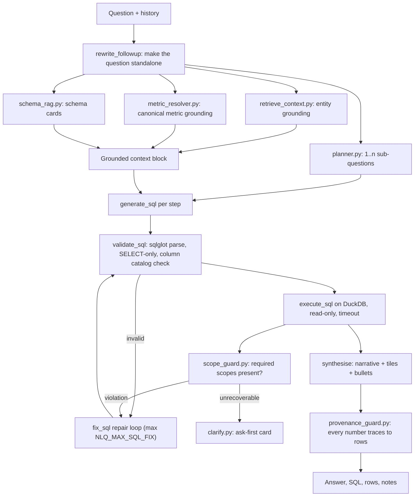

# How a question becomes a grounded answer

This document explains the natural-language-query (NLQ) service in `nlq/`: what is embedded, how retrieval works, how SQL is generated and checked, and why the answer that reaches the user can be trusted. File references are to `nlq/` unless stated otherwise.

## 1. The problem this design solves

A plain text-to-SQL chain (question → LLM → SQL → run → narrate) fails in three recurring ways on real healthcare data:

1. **Wrong table for a familiar word.** "Drug spend" exists in four registers (Part D, Part B, Medicaid, prescriber-level). The model picks one at random and the number is off by an order of magnitude.
2. **Dropped scope.** The question says "in 2023" or "in Medicare Part D"; the generated SQL omits the filter; the answer is confidently wrong.
3. **Hallucinated numbers in the narrative.** The synthesis model rounds, invents, or mixes a number that is not in the result set.

The pipeline below attacks each failure with a deterministic check, not with a better prompt.

## 2. Components



| Stage | File | Deterministic or LLM |
|---|---|---|
| Follow-up rewrite, enrichment, follow-up suggestions | `engine.py` (`rewrite_followup`, `enrich_question`, `suggest_followups`) | LLM (`NLQ_PLANNER_MODEL`) |
| Question decomposition | `planner.py` (`plan_question`) | LLM, returns `PlanStep[]` |
| Entity grounding | `retrieve_context.py` | Embeddings + ChromaDB, plus deterministic filters |
| Metric grounding | `metric_resolver.py` | Lexical + vector match over `metrics.json` |
| Schema retrieval | `schema_rag.py` | Embeddings over schema cards |
| SQL generation / repair | `engine.py` (`generate_sql`, `fix_sql`) | LLM (`NLQ_SQL_MODEL`, `NLQ_SQL_FIX_MODEL`) |
| SQL validation | `engine.py` (`validate_sql`, `_check_columns`) | Deterministic (sqlglot + DuckDB catalog) |
| Execution | `engine.py` (`execute_sql`) | DuckDB, read-only, `NLQ_QUERY_TIMEOUT_S` |
| Scope guard | `scope_guard.py` | Deterministic |
| Clarification | `clarify.py` | Deterministic trigger, LLM-written options |
| Synthesis | `engine.py` (`load_synthesis_prompt`, synthesise) | LLM (`NLQ_SYNTH_MODEL`) |
| Provenance guard | `provenance_guard.py` | Deterministic |
| HTTP | `api.py` (`/ask`, `/ask/stream`) | FastAPI |

Everything lives in one importable module, `engine.py`, so the API and any other front end share a single brain and cannot drift.

## 3. What is embedded, and why

`embed_entities.py` is a one-time build script. It reads the master DuckDB file and writes persistent ChromaDB collections under `chroma_db/`, using OpenAI `text-embedding-3-small` (1536 dimensions) in batches of 200:

| Collection | Source | Purpose |
|---|---|---|
| `drugs` | distinct molecules / brand names with their canonical key | Map "Eliquis" or "apixaban" to the spine key and the right register |
| `drug_classes` | therapeutic classes and ATC-style labels | Resolve class-level questions ("anticoagulants") |
| `manufacturers` | standardised company names and aliases | Resolve "Sun Pharma" to one company id across FDA and CMS sources |
| `hospitals`, `pharmacies`, `care_sites` | facility registries with identifiers | Facility questions by name, city or state |
| `taxonomy` | provider specialty taxonomy codes and labels | Specialty questions ("oncologists in Texas") |
| `golden_queries` | verified question / SQL / answer triples (built by `diagnostics/build_golden_bank.py`) | Exact and near-duplicate reuse of already-verified SQL |

Two more indexes are built lazily on first use and cached with a hash of their source file:

- **Schema cards** (`schema_rag.py`): `prompts/schema_context.md` is split at load time into an always-on CORE (dialect rules, anti-patterns, the master hub map, grounding and output requirements) and one CARD per table section. Each card is embedded once; `select_cards` returns only the cards relevant to the question, entities and planner tables, so the prompt carries the rules plus a handful of tables instead of the full 900-line document.
- **Metric definitions** (`metric_resolver.py`): `metrics.json` holds canonical metrics with source table, formula, required scopes and a verified golden SQL template. Each metric's signature is embedded so a question can be matched to "the" way to compute that metric.

## 4. Retrieval in detail

`retrieve_context.retrieve_context(question, client, chroma)` produces the grounded context block:

1. `extract_entities` asks the model to list the entities in the question (drug, company, facility, specialty, state, program) with a type each.
2. Each entity is embedded (`embed_one`) and searched in the matching collection (`search_collection`). Hits come back with the canonical key and metadata (register, ids), which is what the SQL writer needs to filter correctly.
3. Deterministic filters are built where a vector hit alone is ambiguous: `_state_filter`, `_taxonomy_filter`, `_company_filter`, `_us_company_filter` translate a mention into an exact SQL predicate against the live tables (for example a specialty stem against the taxonomy table, or a company alias against the standardised company map).
4. `golden_exact_match` and `classify_intent` + `structure_compat` check the golden bank first: if the normalised question matches a verified triple, the stored SQL is reused (and the answer is served from the cached rows when a `qid` is passed, which is how regression runs stay fast).
5. `_infer_bucket` tags the question with a domain bucket so the planner and schema retrieval can narrow their menu.

`metric_resolver.resolve_metrics` runs alongside: a lexical score plus cosine similarity against the metric signatures, with thresholds (`NLQ_METRICS_SIM`, `_WINNER`, `_MARGIN`, `_ASSIST`) that decide whether a metric is the single winner, an assist, or no match. `build_metric_grounding` then emits an authoritative block: canonical source, formula, required scopes, golden SQL template. The SQL writer is instructed to compute the metric exactly that way, which is what removes the "four registers" ambiguity.

## 5. Planning and SQL generation

`planner.plan_question` decides whether the question is one step or several ("show X, list Y, and tell me Z"). Compound questions become an ordered list of `PlanStep`s; later steps can depend on earlier ones (`depends_on`), and cohorts are piped between steps so a "top 10" computed in step 1 is the exact cohort step 2 analyses.

For each step, `generate_sql` receives: the standalone question, the CORE rules plus the selected schema cards, the entity predicates, the metric grounding, and the step's dependencies. The output is a single DuckDB SELECT.

## 6. Validation, execution, repair

`validate_sql` parses the SQL with sqlglot and rejects anything that is not a single SELECT (no DDL, DML, PRAGMA, COPY). `_ensure_catalog` loads the live table and column catalog from DuckDB once; `_check_columns` resolves every alias and rejects references to columns that do not exist, so a hallucinated column never reaches the engine. `execute_sql` runs the statement on a read-only connection with `NLQ_QUERY_TIMEOUT_S`. On any failure, `enrich_error` attaches the offending fragment and `fix_sql` asks the repair model for a corrected statement, up to `NLQ_MAX_SQL_FIX` times.

Additional deterministic checks run before results are accepted:

- **Fan-out guard** (`NLQ_FANOUT_GUARD`): detects joins that multiply rows across grains (the classic double count) and forces a corrected shape.
- **Empty-result retry** (`NLQ_EMPTY_RETRY`): when a query returns no rows, `_probe_count` tests the conjuncts one by one to find the predicate that killed the result, then retries with a relaxed but still faithful filter.
- **Coverage guard**: verifies that the years and geographies the question asked for are covered by the source.

## 7. The scope guard: never serve a number that dropped a scope

`scope_guard.check_sql_detail(sql, metrics, standalone)` compares the executed SQL with the scopes the matched metric requires. If the metric requires a year constraint and the SQL has none (`_has_year_constraint`), or the question names a program (`_names_program`) and the SQL has no payer filter (`_has_payer_constraint`), the number is not served. The guard first asks the repair loop to add the missing scope (`violation_prompt`, `escalation_prompt`); if it cannot be added faithfully, the engine returns a refusal payload explaining exactly which scope was missing rather than an unscoped number. This rule came from a live failure where two identical runs of "How much was spent on Eliquis in Medicare Part D in 2023?" produced different totals because one run lost `year = 2023`.

## 8. Synthesis and the provenance guard

The synthesis prompt (`prompts/synthesis_prompt.md`) asks for a headline, KPI tiles, bullets and a short narrative built only from the returned rows. Two guards then run:

- The engine drops any tile, bullet or headline that cites a bare integer of four or more digits that is not present in the result set.
- `provenance_guard` extends this to compact notations ("$4.2B", "1.3M"): `build_candidates` collects every numeric value from the step results, `ungrounded_compacts` finds compact numbers in the text that match none of them within rounding, and `scrub_compact_sentences` removes those sentences. `prefer_money_hero` ensures the headline uses a money figure when the question was about spend, and `interpretation_notes` adds a visible note whenever the pipeline had to interpret the user's words (for example mapping "Medicare" to Part D only), so the interpretation is disclosed rather than hidden.

The user therefore sees: the answer, the exact SQL, the rows, and the notes that explain any interpretation.

## 9. Clarify-first

`clarify.should_clarify` fires when the question is genuinely unanswerable as asked: a false premise, a scope-guard refusal, or an empty result the retry could not recover. `build_clarify` returns a card with one-click options (one marked recommended) and an editable prefill. Nothing is served until the user picks. This mirrors how a careful analyst would respond, and it is switched by `NLQ_CLARIFY`.

## 10. Conversation memory

`rewrite_followup` turns "and for 2022?" into a standalone question using the last `NLQ_MAX_HISTORY_TURNS` turns, each truncated to `NLQ_HISTORY_ANSWER_CHARS` characters of answer, with a timeout so a slow rewrite never blocks the request.

## 11. Evaluation: the golden bank

`diagnostics/build_golden_bank.py` assembles verified question / SQL / answer triples; `diagnostics/retrieval_probe.py` and `dump_vectors.py` measure whether retrieval surfaces the right entities and cards; a regression runner re-executes the bank and flags drift (a changed number, a changed SQL signature, a new refusal). The platform's `/verify` page reads these diagnostics so regressions are visible in the UI, not only in logs. Results are stored outside the repository.

## 12. HTTP contract

`POST /ask` and `POST /ask/stream` accept:

```json
{
  "question": "How much did Medicare Part D spend on apixaban in 2023?",
  "history": [{ "question": "...", "answer": "..." }],
  "max_rows": 500,
  "depth": "auto",
  "enrich": false,
  "advisory": false,
  "qid": null
}
```

The streaming variant emits newline-delimited JSON events (stage, SQL, rows, answer) so the platform's Ask console can show progress. `GET /health` reports database and index status.

## 13. Cost and latency

With `gpt-4o-mini` for every LLM stage and `text-embedding-3-small` for embeddings, a typical single-step question costs on the order of a cent; golden-bank hits cost nothing beyond the embedding call. Query execution on DuckDB is local and free. Timeouts (`NLQ_QUERY_TIMEOUT_S`, `NLQ_REWRITE_TIMEOUT_S`, `NLQ_GROUNDING_TIMEOUT_S`) bound the worst case.

## 14. Rebuilding the index

```bash
cd nlq
source .venv/bin/activate
export HEALTHCARE_DUCKDB=/path/to/healthcare.duckdb OPENAI_API_KEY=sk-...
python embed_entities.py          # ~3.5 GB on disk; embeds all collections listed above
```

Schema cards and metric vectors rebuild themselves when `prompts/schema_context.md` or `metrics.json` change (they are keyed by a content hash).
