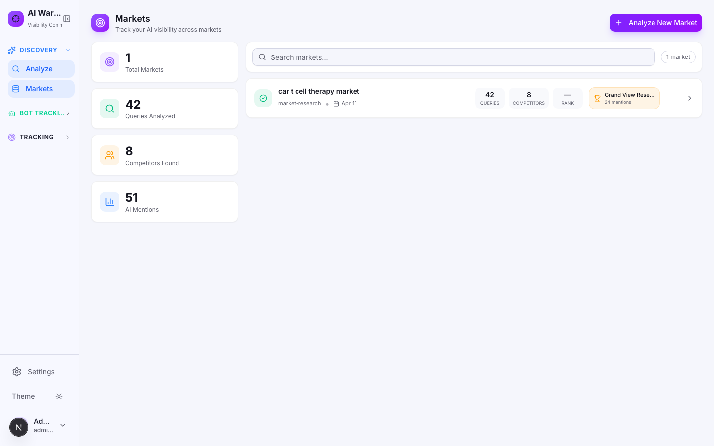
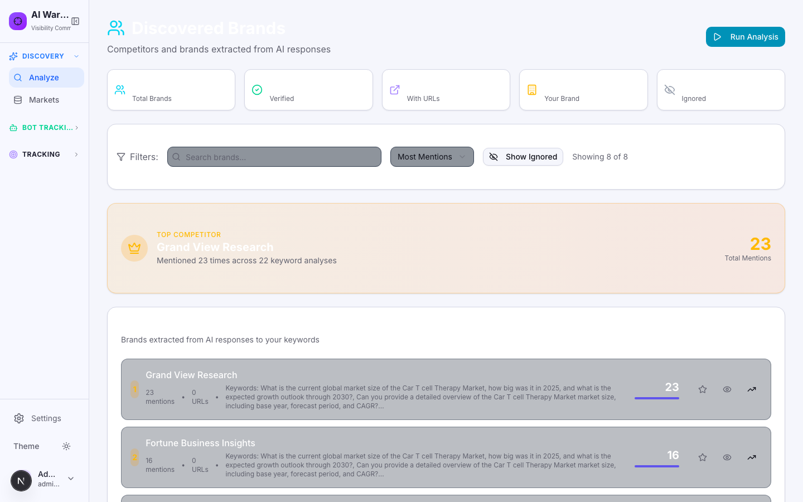
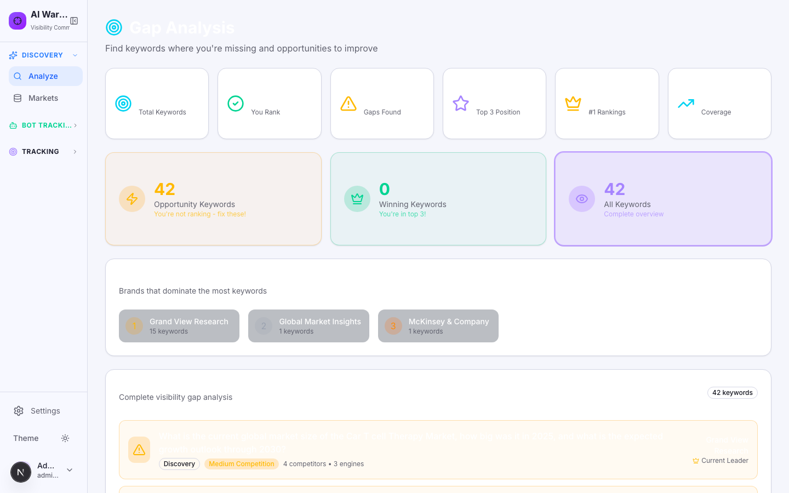
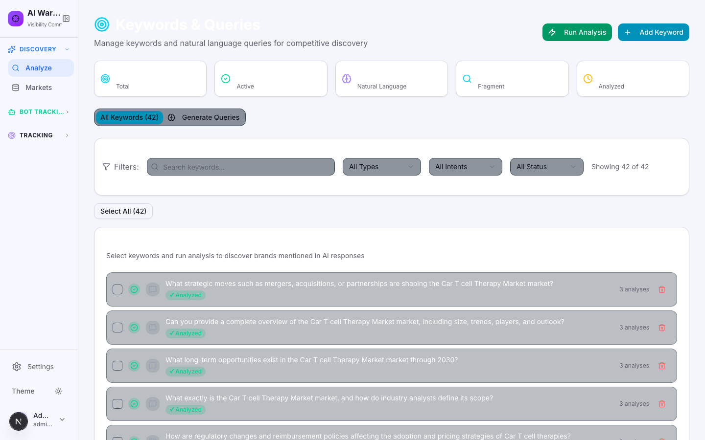
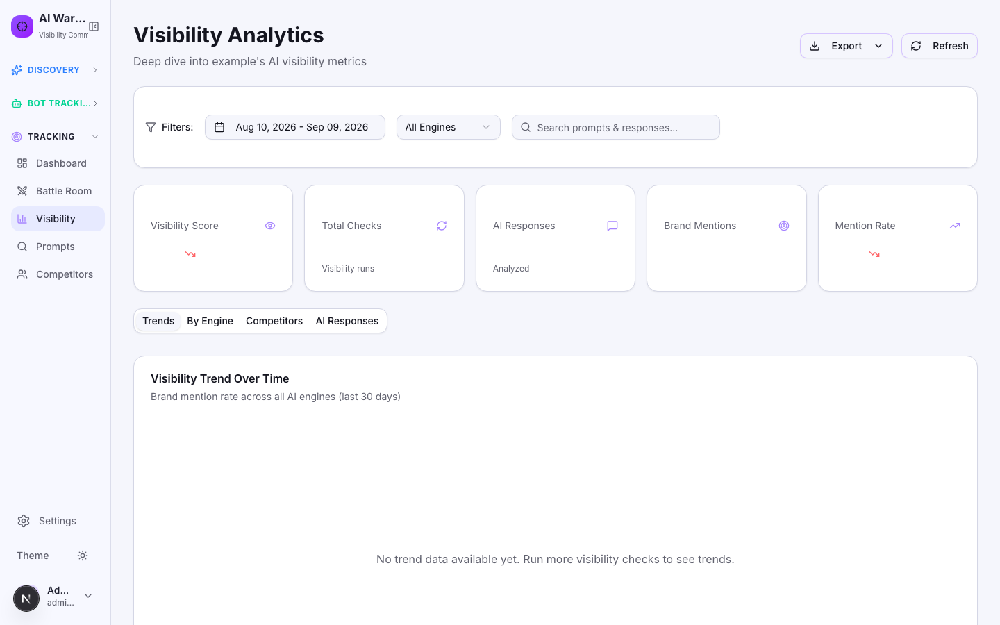
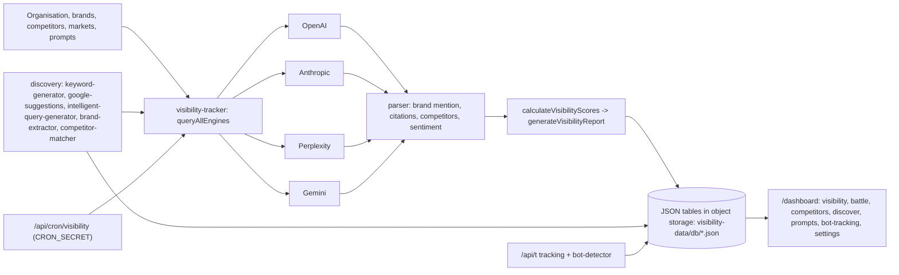

# AI Visibility Platform

Measures how brands and products show up inside AI answer engines: it issues the questions buyers ask to OpenAI, Anthropic, Perplexity and Gemini, parses the answers for brand mentions, citations and sentiment, discovers competitors that appear instead, and tracks the trend over time. It also records which AI crawlers visit your own sites.

   

> Source code is private. This page, the design write-ups and the recordings are the public showcase; a code walkthrough is available on request.

## Screens

| Markets | Discovered brands |
|---|---|
|  |  |

| Gap analysis | Keywords & queries |
|---|---|
|  |  |

| Visibility analytics |
|---|
|  |

## What it does

- **Visibility tracking:** for each prompt in a market, query every configured engine and record whether the brand is mentioned, where, with which citations and what sentiment (`src/lib/ai-engines/`).
- **Discovery mode:** generate the questions a market's buyers ask (keyword generator, Google autocomplete and "people also ask" expansion, intelligent query generation), run them, and extract every brand and URL the engines mention, ranking competitors you did not know about (`src/lib/discovery/`).
- **Competitor intelligence:** leaderboard, citations, content gaps and page-to-page comparison against competitor pages (`content-analyzer`, `/api/page-compare`).
- **Bot tracking:** a lightweight tracking endpoint (`/api/t`) and script identify AI and search crawlers hitting your sites, with daily summaries and site audits (`bot-tracker.ts`, `bot-detector.ts`).
- **Scheduling:** `/api/cron/visibility` runs due checks when called by any cron service, protected by a bearer secret.
- **Reporting:** dashboard views for visibility, battle (head-to-head), competitors, discovery, prompts and bot activity, with PDF export.

## Architecture

## Tech stack

| Layer | Choice |
|---|---|
| App | Next.js 16 (App Router), React 19, TypeScript, Tailwind, Radix, Recharts, framer-motion |
| Engines | Vercel AI SDK (`ai`, `@ai-sdk/openai`, `@ai-sdk/anthropic`), Anthropic SDK, Google Generative AI SDK, Perplexity via REST |
| Storage | JSON document tables in S3-compatible object storage (`src/lib/s3-db.ts`), one array file per table under `visibility-data/db/`; a Prisma-like facade in `src/lib/db.ts` keeps call sites simple |
| Export | jsPDF + autotable, file-saver |
| Validation | zod, react-hook-form |

## Key engineering decisions

- **Engine abstraction with safe failure.** `visibility-tracker.ts` wraps each engine call (`safeQuery`) and substitutes a placeholder response on error, so one engine outage never voids a run.
- **Deterministic parsing before any scoring.** `parser.ts` checks mention, position, citations (including domains without full URLs) and sentiment with explicit rules, so scores are reproducible across runs.
- **Discovery that starts from buyer language.** Keywords are expanded through Google autocomplete and people-also-ask before they are turned into prompts, so the questions match what people actually type.
- **Own-brand detection guards.** `checkIfOwnBrand` / `checkOwnBrandMention` avoid counting your own domain as a competitor citation.
- **Storage without a database server.** JSON tables in object storage keep the deployment to one process plus a bucket; the facade in `db.ts` isolates call sites from the storage format.

## Quality

`npm run lint`; `npm run test:api-keys` for integration checks. No unit test suite is included.

## Status & roadmap

- Working: tracking, discovery, competitors, page comparison, bot tracking, scheduling, exports.
- Next: persistent run history charts per engine and a proper job runner instead of external cron.

## Design write-up

[measurement-model.md](../docs/measurement-model.md)

## License

All rights reserved; showcase only. See [LICENSE](../LICENSE).
