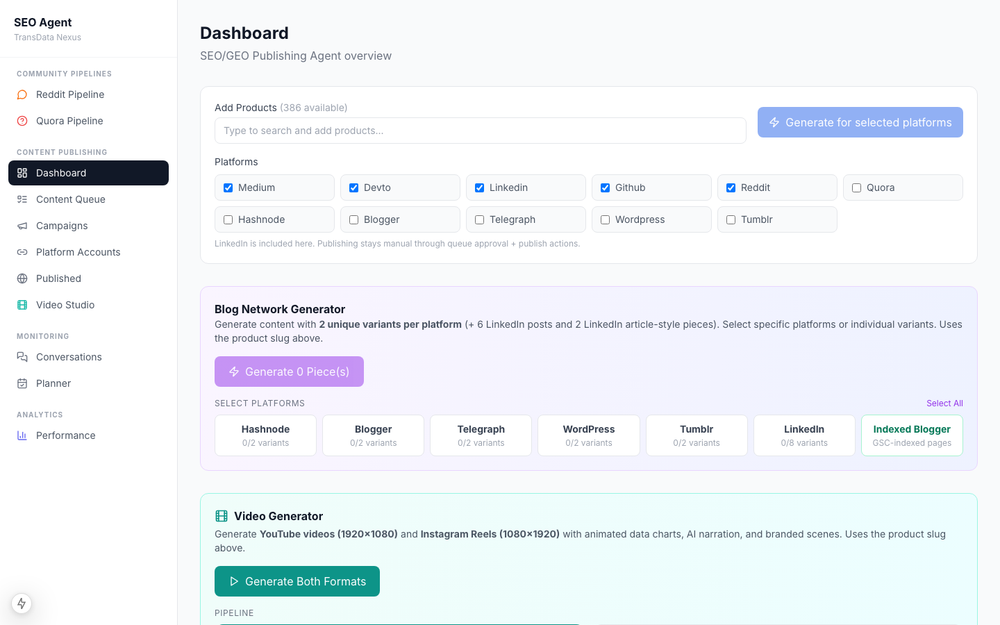
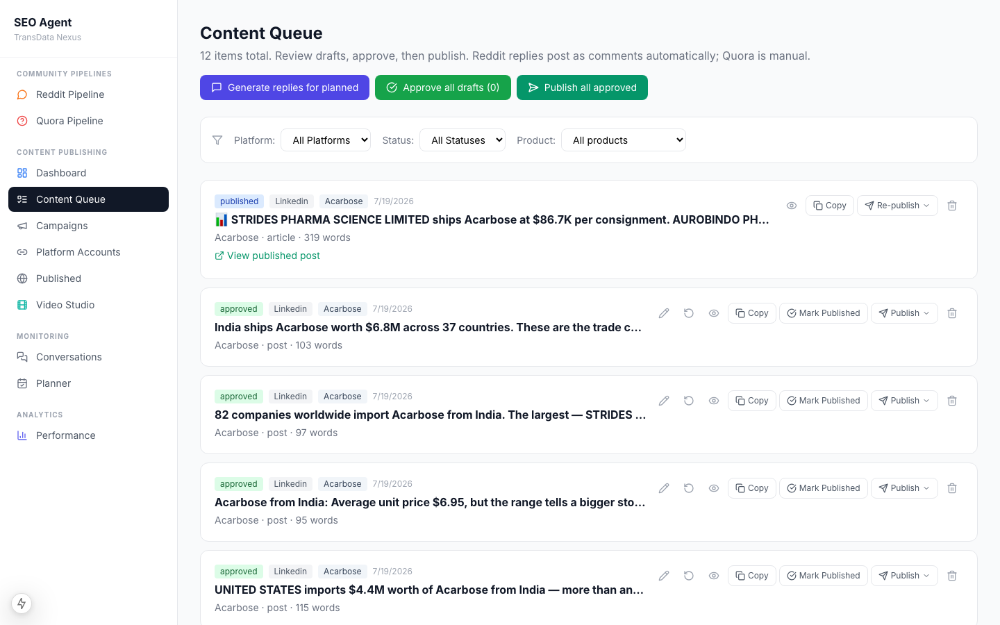
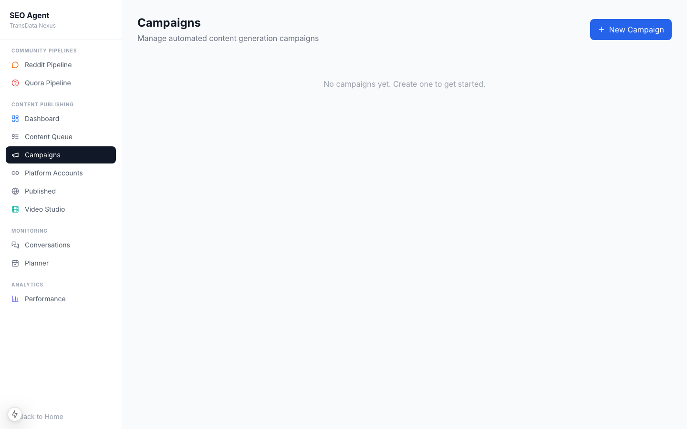
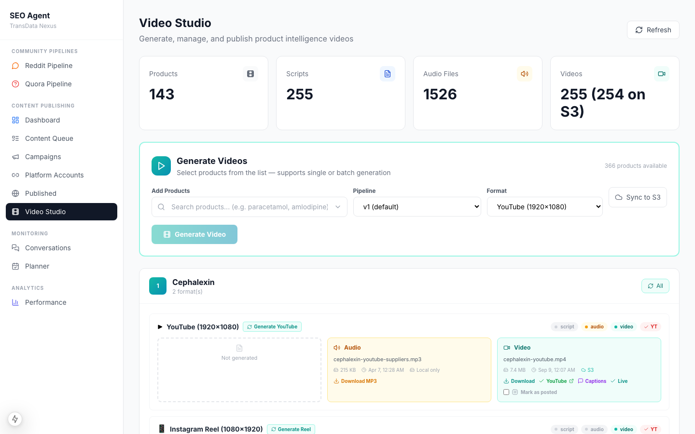
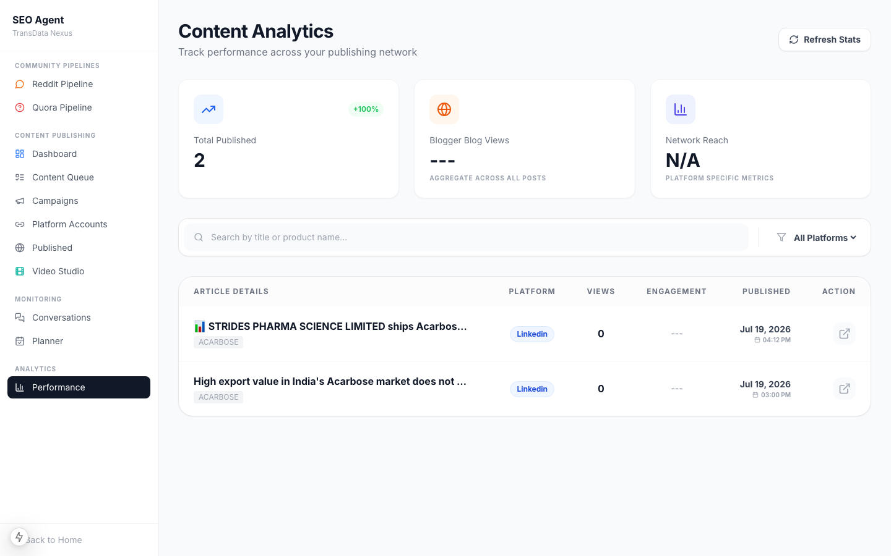
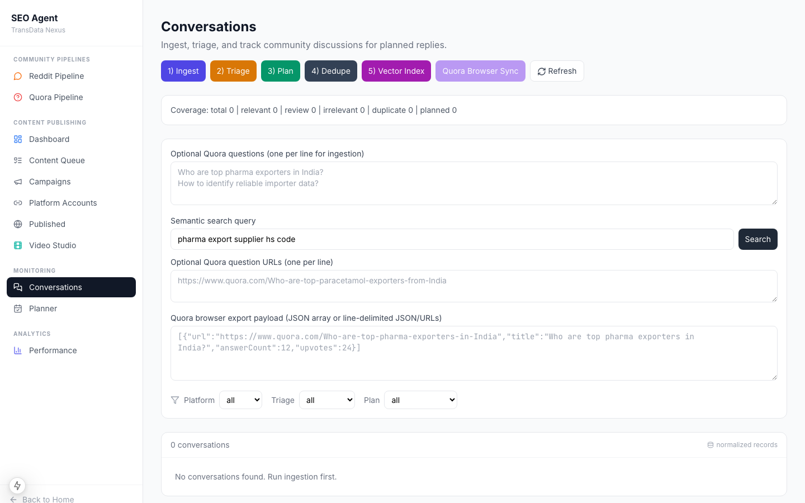
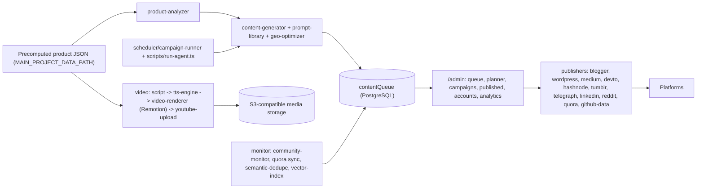

# SEO / Distribution Agent

Operator console and agent engine that turns trade-data pages into platform-native content (articles, posts, Q&A answers, open datasets, narrated videos), publishes it through third-party platform APIs, and monitors communities for questions worth answering. Built for SEO backlinks and AI-search visibility (GEO).

    

> Source code is private. This page, the design write-ups and the recordings are the public showcase; a code walkthrough is available on request.

## Screens

| Admin home | Review queue |
|---|---|
|  |  |

| Campaigns | Video pipeline |
|---|---|
|  |  |

| Analytics | Community conversations |
|---|---|
|  |  |

## What it does

- Reads the precomputed product dataset of the trade website and extracts the facts worth publishing (`agent/engine/product-analyzer.ts`).
- Generates platform-specific content with a prompt library per platform and applies GEO formatting: citation blocks, structured data, FAQ schema (`content-generator.ts`, `geo-optimizer.ts`).
- Puts everything through a **review queue**; the operator approves, edits or rejects from `/admin` before anything is published.
- Publishes through eleven publishers: Blogger, WordPress, Medium, Dev.to, Hashnode, Tumblr, Telegraph, LinkedIn, Reddit, Quora (assisted), and GitHub open-data repositories.
- Produces **narrated videos** per product: script → OpenAI text-to-speech → Remotion render → YouTube upload, with social captions and link validation.
- **Community monitoring**: ingests Reddit and Quora conversations, triages relevance, plans responses, generates replies, and de-duplicates near-identical threads with a semantic index.
- Runs campaigns on a schedule and tracks published URLs to avoid repetition.

## Architecture

## Tech stack

| Layer | Choice |
|---|---|
| App | Next.js 15 (App Router, port 3001), React, TypeScript, Tailwind, Radix |
| Persistence | PostgreSQL via Prisma (schema `seo`): queue, published content, campaigns, platform accounts, conversations, response plans, semantic/vector indexes, scraping jobs, keywords, scheduler config |
| Content | OpenAI chat models; `marked` for markdown, custom HTML/Telegraph converters |
| Video | OpenAI TTS, Remotion (bundler, renderer, transitions, media-utils), `sharp` |
| Platform APIs | `googleapis` (Blogger, YouTube), REST clients per publisher |
| Media storage | S3-compatible object storage (MinIO locally) |

## Key engineering decisions

- **Review before publish.** Nothing leaves the system without an approved queue item; publishers operate only on `publish-approved-queue-item`.
- **One publisher interface.** `base-publisher.ts` defines the contract; adding a platform is one file.
- **GEO as a formatting stage**, not a prompt trick: citation blocks, FAQ schema and structured data are applied after generation so every platform gets consistent, machine-readable output.
- **Link hygiene.** `agent/video/valid-links.ts` validates every outbound link against the website's list of existing URLs before captions or descriptions are written.
- **Semantic de-duplication of conversations** (`monitor/semantic-dedupe.ts`, `vector-index.ts`) so the same community question is planned once.
- **Staged video pipeline** with resumable stages (`script`, `audio`, `render`, `status`) so a failed render does not repeat narration.

## Quality

`npm run lint`. Publisher and pipeline behaviour is exercised through the CLI commands; no automated test suite is included.

## Status & roadmap

- Working: generation, queue and admin, all listed publishers, video pipeline, community monitoring, campaigns.
- Quora publishing is assisted (templates plus browser sync) because the platform has no write API.
- Next: retry policies per publisher and analytics on published-URL performance.

## Design write-up

[distribution-pipeline.md](../docs/distribution-pipeline.md)

## License

All rights reserved; showcase only. See [LICENSE](../LICENSE).
