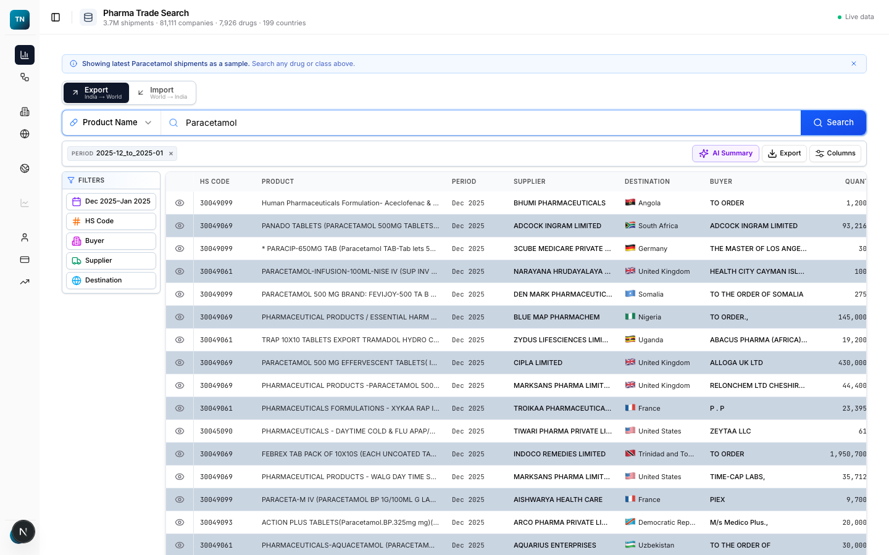
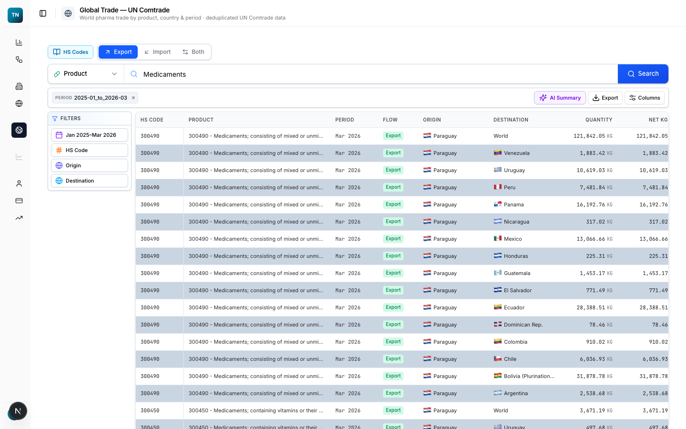
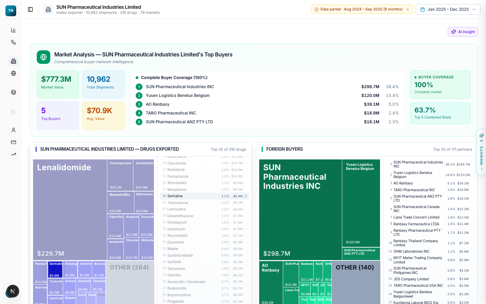
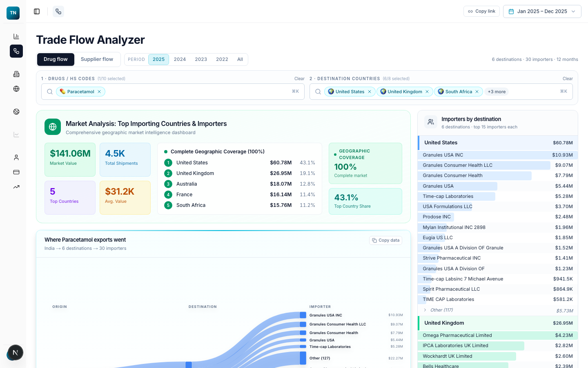
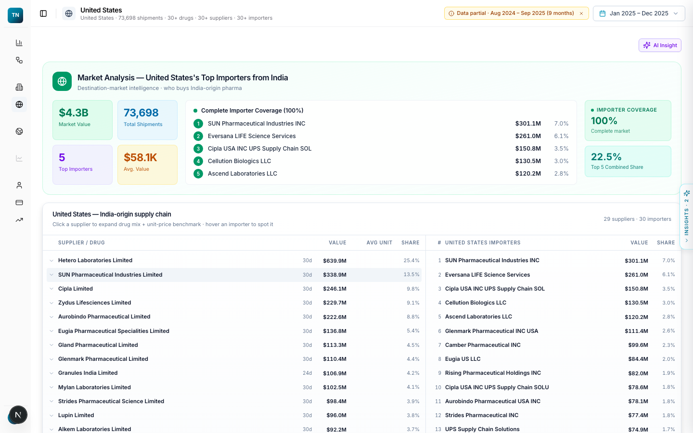
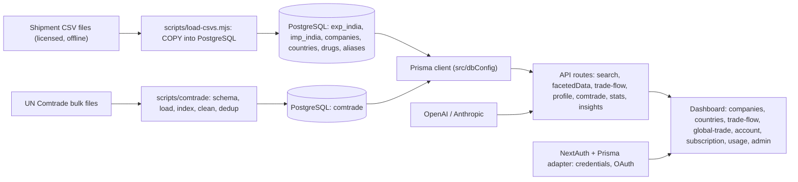

# Trade Platform

SaaS application for pharmaceutical trade intelligence: search and profile India's export and import shipments by product, company and country, explore global bilateral flows from UN Comtrade, and get AI-written insights, behind authentication, plans and usage credits.

    

> Source code is private. This page, the design write-ups and the recordings are the public showcase; a code walkthrough is available on request.

## Screens

| Dashboard | Global trade (Comtrade) |
|---|---|
|  |  |

| Company profile | Trade-flow explorer |
|---|---|
|  |  |

| Country profile |
|---|
|  |

## What it does

- Global entity search with autocomplete across products, companies, countries and HS codes.
- Company and country profile pages: shipment volumes and values, partners, products, trends, share, with exportable tables.
- Trade-flow explorer: faceted filtering of shipment records by product, direction, period, origin and destination, with charts and a world map.
- Global Trade module on UN Comtrade data: bilateral footprints, HS reference, facets and insights.
- Account, subscription plans, usage credits and an admin area with index-health checks.
- AI insights on demand, generated from the filtered data (OpenAI, with the Anthropic SDK available as an alternative provider).

## Architecture

## Tech stack

| Layer | Choice |
|---|---|
| Framework | Next.js 15 (App Router), React 19, TypeScript |
| Data | PostgreSQL 17 (shipments) and PostgreSQL 14 (Comtrade), Prisma ORM, bulk `COPY` loaders |
| Auth | NextAuth with Prisma adapter; credentials (bcrypt) and OAuth providers configurable |
| State / data fetching | Redux Toolkit, TanStack Query, react-hook-form + zod |
| UI | Tailwind, Radix primitives, TanStack Table, react-virtualized, Recharts, d3-geo / d3-hierarchy / d3-sankey, topojson |
| Export | xlsx |

## Key engineering decisions

- **Bulk COPY loading with coercion.** `scripts/load-csvs.mjs` streams CSV rows, normalises `NA`/blank numerics to NULL and assigns UUIDs, which is the fastest path into PostgreSQL and keeps types strict.
- **Alias tables for entity resolution.** `company_aliases`, `country_aliases`, `therapeutic_class_aliases` and `quarantine_companies` model the messy names in customs data and track harmonisation progress explicitly (`harmonization_progress`).
- **Period-aware caching.** `lib/periodCache.ts` and `latestPeriodRange.ts` cache the latest available period per table so every dashboard defaults to real data without a scan.
- **Credits as a first-class model.** `UserCredits`, `SubscriptionPlan` and `profileCredits.ts` meter profile views and exports.
- **Comtrade isolated in its own database.** Bilateral flows are large and independently refreshed; keeping them in a separate database keeps the app schema clean.

## Quality

`npm run lint`. No automated tests are included in this repository.

## Status & roadmap

- Working: search, profiles, trade-flow explorer, Comtrade module, auth, plans and credits, admin index health.
- Next: automated tests for the API routes and a data-refresh job for new shipment periods.

## Design write-up

[data-model.md](../docs/data-model.md)

## License

All rights reserved; showcase only. See [LICENSE](../LICENSE).
