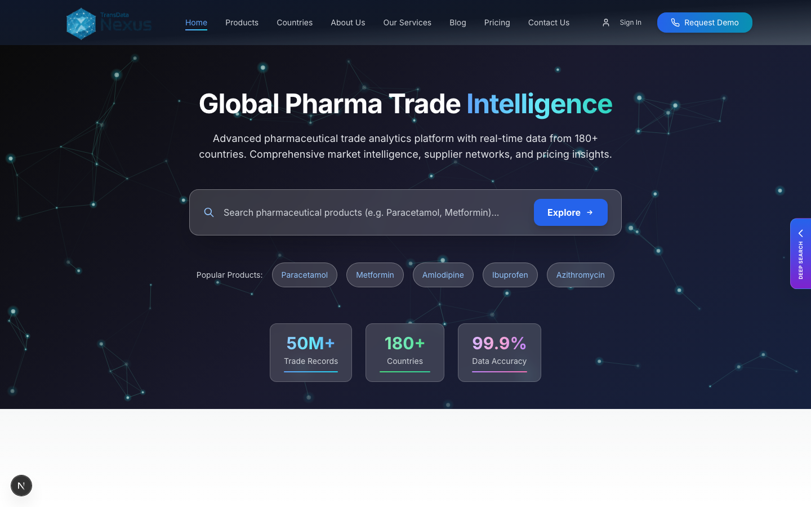
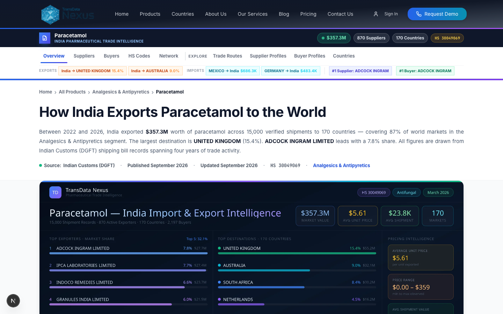
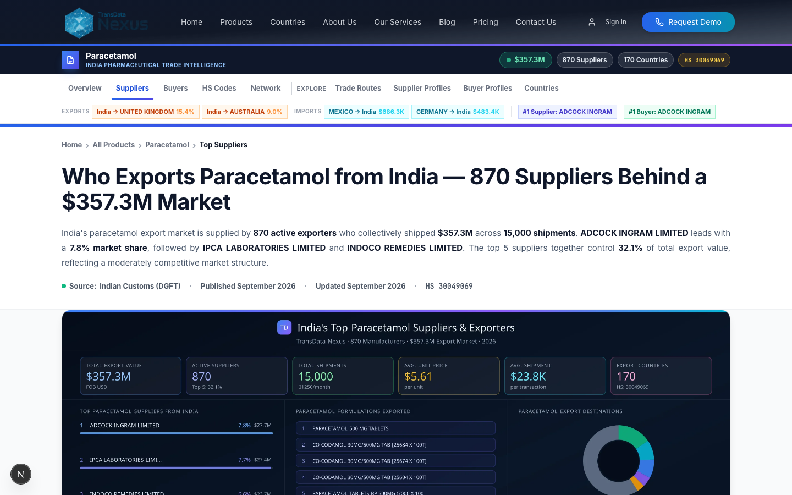
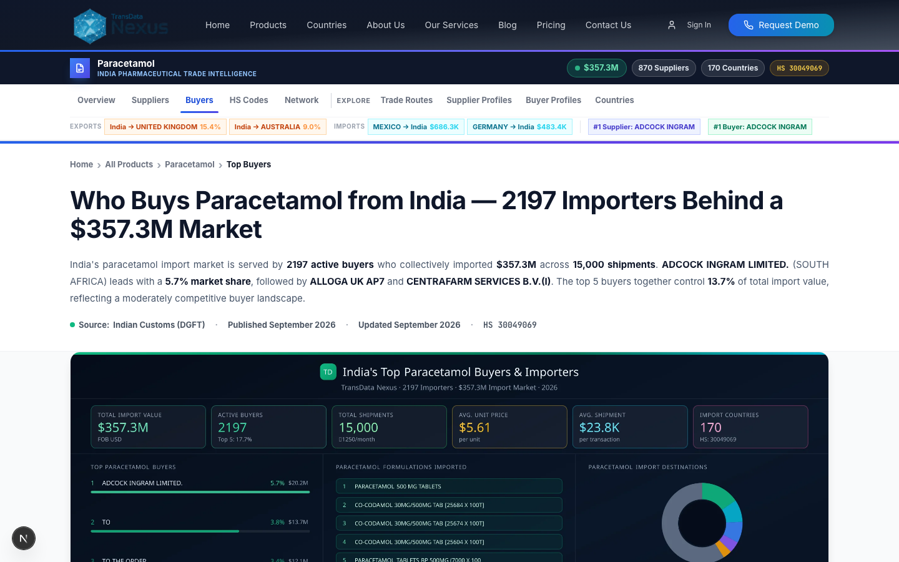
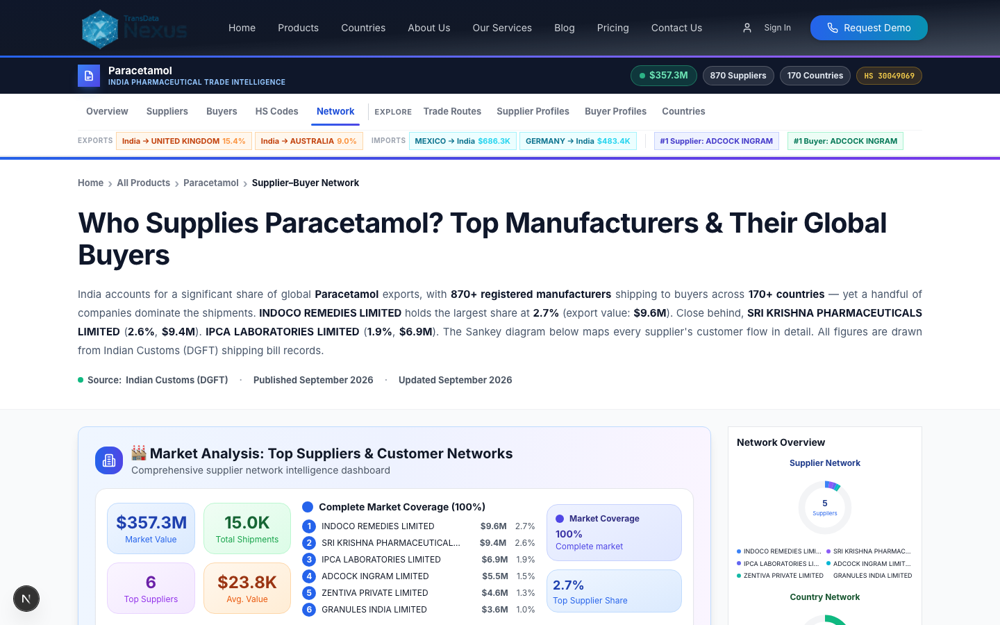
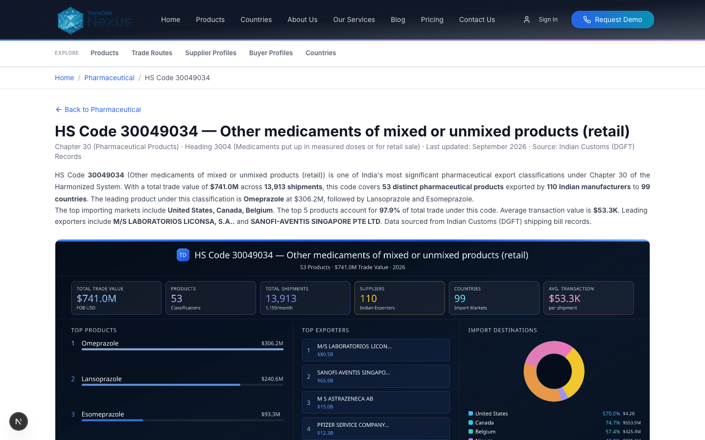
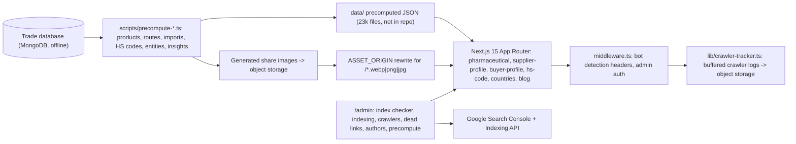

# Trade Website

Programmatic-SEO marketing website for pharmaceutical trade intelligence: thousands of product, supplier, buyer, HS-code and country pages generated from a precomputed dataset, with an admin console for indexing, crawler analytics and content operations.

    -C72E49)

> Source code is private. This page, the design write-ups and the recordings are the public showcase; a code walkthrough is available on request.

## Screens

| Home | Product hub |
|---|---|
|  |  |

| Suppliers | Buyers |
|---|---|
|  |  |

| Supplier-buyer network (sankey) | HS code page |
|---|---|
|  |  |

Recorded walkthrough: 

[Download the MP4](../media/website/walkthrough.mp4)

## What it does

- Publishes a page for every pharmaceutical product traded from India, with export routes, top suppliers, top buyers, trends and a generated share image, plus profile pages for suppliers, buyers, HS codes and destination countries.
- Renders every page from **precomputed JSON** rather than live database queries, so the site serves with no database attached (`DB_DISABLED=1`) and stays fast under crawler load.
- Serves generated images through a rewrite to S3-compatible object storage, keeping the repository small and the image pipeline independent of the app.
- Gives the operator an **admin console**: Search Console index checking and indexing requests, sitemap submission, crawler-visit analytics with bot identification, dead-link reports, author management and precompute controls.
- Publishes the SEO surface a data site needs: canonical URLs, JSON-LD (Product, Organization, VideoObject, ImageObject), image/news/video sitemaps, RSS, `llms.txt`.
- Captures leads through contact, consultation and report-request forms with email delivery.

## Architecture

## Tech stack

| Layer | Choice |
|---|---|
| Framework | Next.js 15 (App Router, Turbopack dev), React 19, TypeScript |
| Styling / UI | Tailwind CSS, Radix primitives, framer-motion, lucide icons |
| Charts | d3, d3-geo, d3-sankey (trade-flow and route visuals), custom treemap layout |
| Data | Precomputed JSON under `data/`; Prisma + MongoDB only for the precompute scripts |
| Images | `sharp` for generation; S3-compatible storage behind an origin rewrite |
| Integrations | Google Search Console / Indexing API (service account), OpenAI (insight text), nodemailer (forms) |

## Key engineering decisions

- **Precompute, then serve static-like pages.** Every entity page reads one JSON file; there is no per-request database call in the public routes (`DB_DISABLED=1` short-circuits `lib/database-utils.ts`).
- **Images off the repo, behind one origin variable.** `next.config.ts` rewrites `/*.webp|png|jpg` to `ASSET_ORIGIN`; switching storage is one env change and no page markup changes.
- **Edge-cheap bot detection.** `middleware.ts` uses string matching (no regex) against known crawler user agents and forwards the verdict as request headers; `lib/crawler-tracker.ts` batches visits in a write-behind buffer so logging costs about a millisecond per request.
- **Operator tooling in the same app.** The admin console talks to Google's Search Console and Indexing APIs with a service account, so indexing status and requests live next to the content they concern.
- **Lead capture that never breaks the page.** Form handlers make database writes non-fatal so a demo request still delivers by email if the database is absent.

## Quality

`npm run type-check` and `npm run lint`. There is no automated test suite in this repository; page rendering was verified locally with Playwright against the precomputed dataset.

## Status & roadmap

- Live features: all public page types, sitemaps and structured data, admin console, crawler analytics, lead forms.
- The dataset and image corpus are regenerated from the trade database; regeneration scripts are included, data is not.
- Next: move share-image generation into a queue worker and add page-level tests.

## Design write-up

[programmatic-seo.md](../docs/programmatic-seo.md)

## License

All rights reserved; showcase only. See [LICENSE](../LICENSE).
