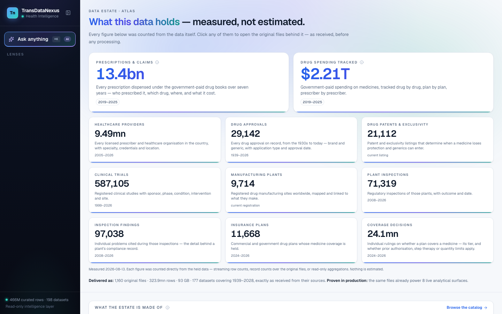
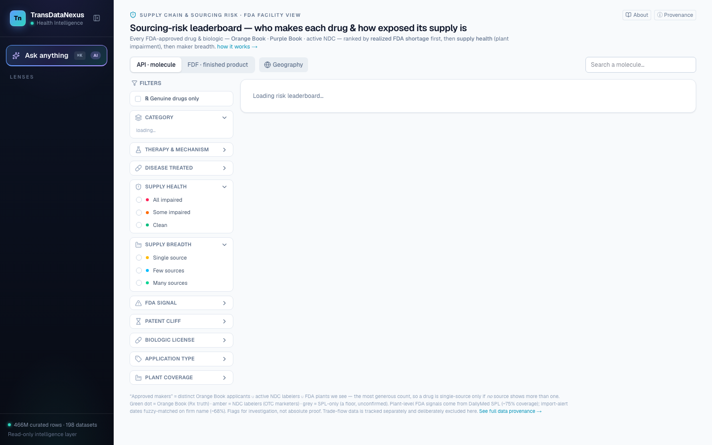
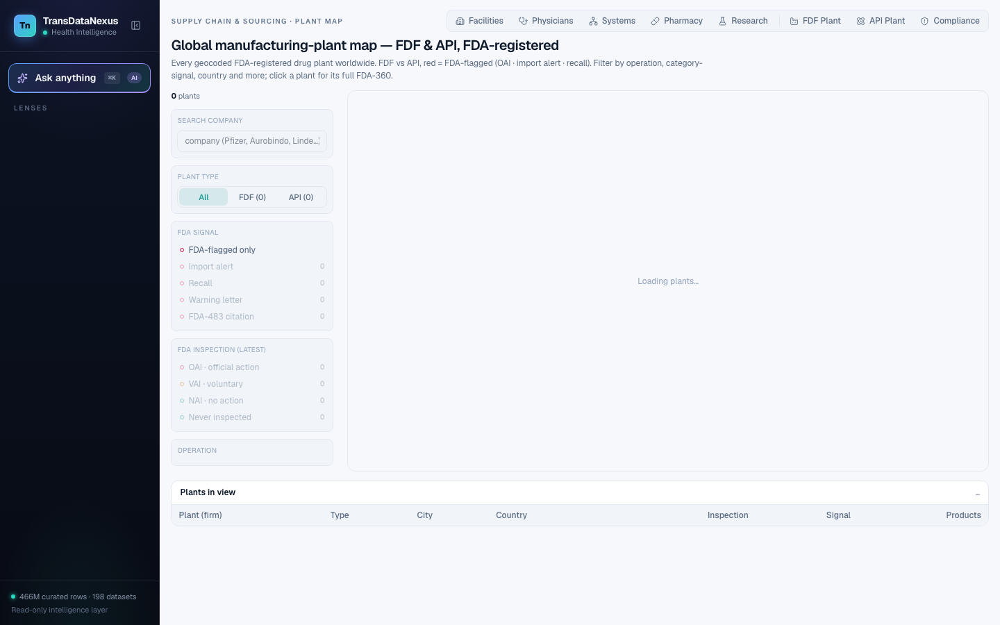
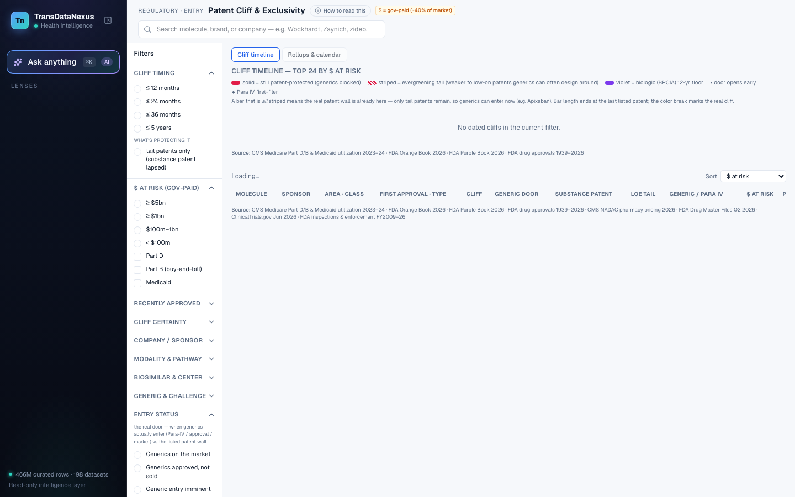
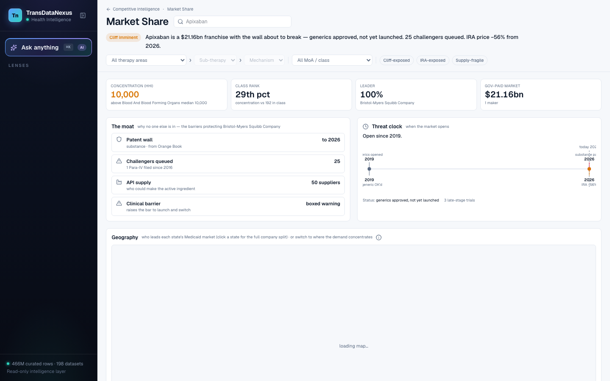
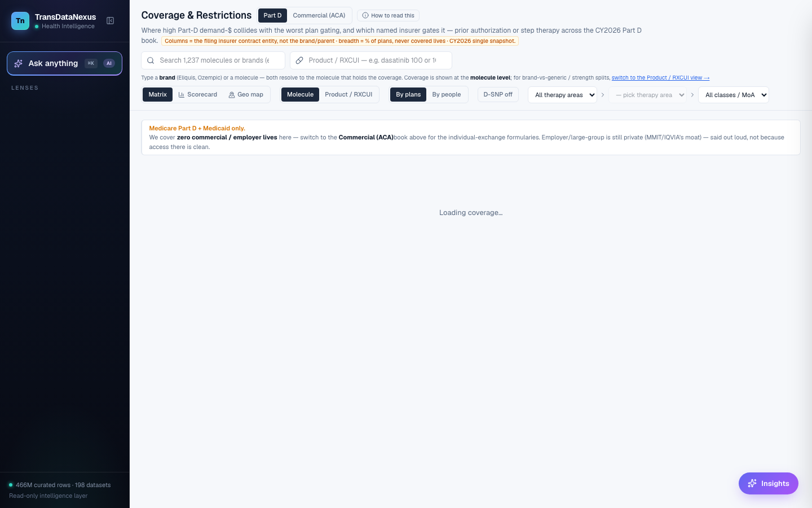
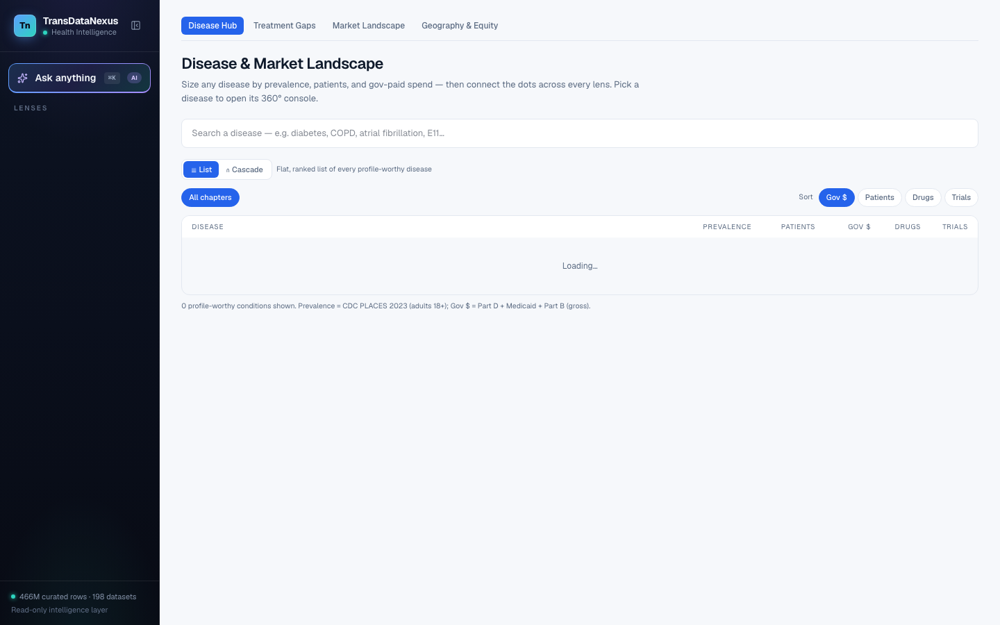
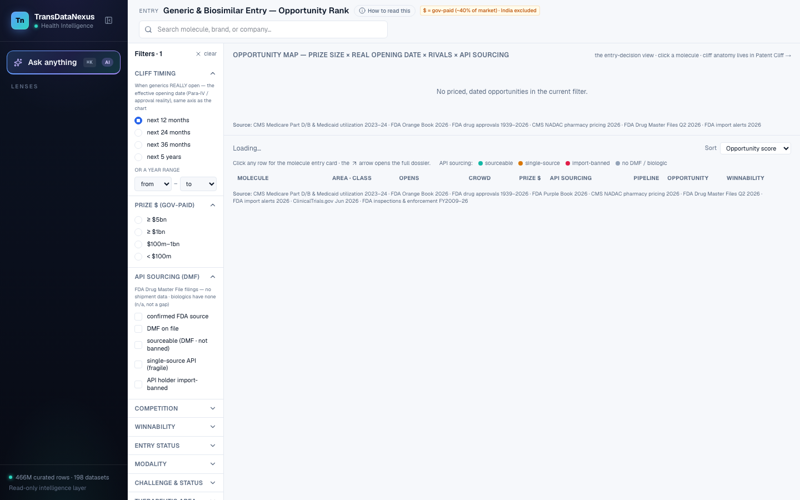
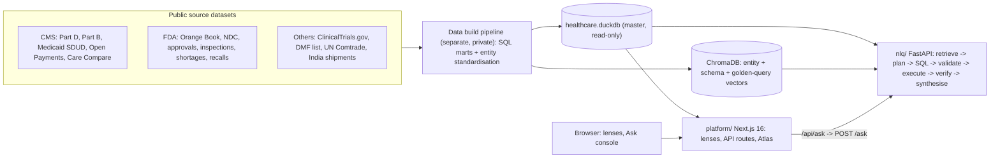

# US Healthcare Analytics + NLQ

Pharma-commercial intelligence on US public healthcare data: an analytics platform with nine decision "lenses", and a natural-language query service that turns plain-English questions into verified SQL and grounded answers.

     

> Source code is private. This page, the design write-ups and the recordings are the public showcase; a code walkthrough is available on request.

## Screens

| Data Atlas | Supply risk |
|---|---|
|  |  |

| Plant map | Patent cliff |
|---|---|
|  |  |

| Market share | Coverage |
|---|---|
|  |  |

| Disease landscape | Generic entry |
|---|---|
|  |  |

Recorded walkthrough: 

[Download the MP4](../media/health/walkthrough.mp4)

## What it does

- Answers the questions a generics manufacturer, distributor or investor asks about the US market: where demand is, who supplies it, which plants carry regulatory risk, when patents expire, how a molecule is paid for, and who the competitors are.
- Models the market on a **molecule spine**: every dataset (spending, prescribers, approvals, plants, shortages, formularies, trade flows) is resolved to one canonical molecule key, so numbers from different sources can sit on one page without double counting.
- Lets a non-technical user ask a question in English and get a **grounded** answer: the SQL is generated against a curated schema, validated, executed read-only, and every headline number is checked against the returned rows before it is shown.
- Ships a **Data Atlas** that catalogues every dataset behind the platform with lineage, vintage and integrity checks.
- Is built for an 8 GB laptop: DuckDB is opened read-only through its CLI, every query carries its own memory cap, and heavy aggregations are pre-built as marts.

## Architecture



The platform queries DuckDB directly for its lenses. The Ask console proxies to the NLQ service, which uses the same database plus a vector index for grounding. The data build pipeline that produces the DuckDB file and the marts lives in a separate private repository.

## Tech stack

| Layer | Choice | Why |
|---|---|---|
| Web app | Next.js 16 (App Router), React, TypeScript | Server components read DuckDB per request; no client bundle carries data |
| Charts / maps | Recharts, d3 (geo, hierarchy, sankey), deck.gl + MapLibre | Plant maps with 9k+ pins, treemaps, flow diagrams |
| Analytical DB | DuckDB (master file + side databases + parquet) | Columnar, single-file, fast on a laptop; opened read-only via CLI |
| NLQ API | FastAPI + Pydantic | Thin HTTP layer over one shared "brain" module |
| Vector store | ChromaDB (persistent, local) | Entity and schema retrieval; golden-query cache |
| LLM | OpenAI `gpt-4o-mini` (planner, SQL, repair, synthesis), `text-embedding-3-small` | Cost per question in the cents range |
| SQL safety | sqlglot | Parse, restrict to read-only SELECT, check columns against the catalog |
| Tests | Vitest (98 files), Playwright (26 e2e specs), golden-answer regression bank | |

## Key engineering decisions

- **One molecule spine, never sum across grains.** `platform/lib/ndcGrain.ts` and the journey/market-access modules resolve every source to a canonical molecule key and take MAX rather than SUM across overlapping registers, because raw NDC joins fan out (up to 8% phantom prescriptions were measured before this rule).
- **Read-only DuckDB through the CLI, with per-query guardrails.** `platform/lib/db.ts` spawns the DuckDB CLI per query and prepends memory and thread caps to every statement so a page that runs six queries concurrently cannot exhaust an 8 GB machine.
- **Verify-then-serve in the NLQ.** A generated SQL statement is parsed with sqlglot, restricted to SELECT, checked against the live catalog, executed with a timeout, then passed through scope and provenance guards before any number reaches the user (`nlq/scope_guard.py`, `nlq/provenance_guard.py`).
- **Ask first when the question is unanswerable as asked.** `nlq/clarify.py` returns a one-click clarification card instead of a wrong number when the premise fails.
- **Schema-RAG instead of a 900-line schema in every prompt.** `nlq/schema_rag.py` keeps the cross-cutting rules always-on and retrieves only the table cards the question needs.
- **Golden regression bank.** Hundreds of question/SQL/answer triples are re-run to catch drift; the platform's `/verify` route reads the diagnostics.
- **Evidence, not advice.** Lens pages show signals with their sources and vintages (`platform/lib/vintages.ts`, `platform/lib/sources.ts`) rather than recommendations.

## Quality

```bash
cd platform
npm run test          # vitest, 98 test files across lib/ and components/
npm run test:e2e      # playwright, 26 specs (run in chunks on a laptop)
npm run lint
```

The NLQ has a golden-answer regression harness in `nlq/diagnostics/` (see the deep dive for how it is built and scored).

## Status & roadmap

- Lenses live: Entry & generics, Supply, Market access, Competitive, Disease, Facility, Molecule journey, Regulatory, Trade, plus the Data Atlas and the Ask console.
- The NLQ pipeline stages are individually switchable; scope, provenance and clarify guards are on in the reference configuration.
- Not part of the showcase: the data build pipeline and the datasets. A `/rnd` design area documents lens studies and is exploratory.

## Design write-up

[nlq-rag-architecture.md](../docs/nlq-rag-architecture.md)

## License

All rights reserved; showcase only. See [LICENSE](../LICENSE).
